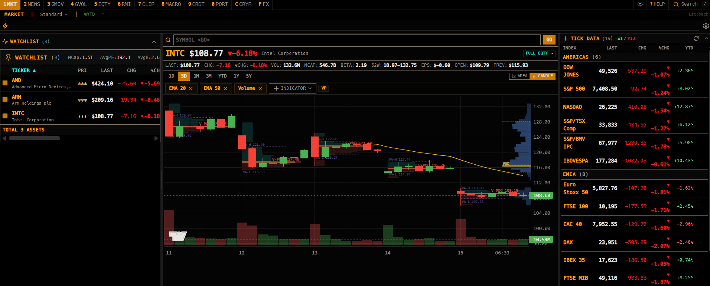

# Bloomberg Terminal

A personal Bloomberg-style financial terminal built for local use. Real-time market data, portfolio management, macro analytics, regime detection, and AI-powered analysis — all in a keyboard-driven dark UI.

> **Local-only by design.** No authentication layer. Do not expose this to the internet without adding auth.



---

## Features

| View | Key | Description |
|------|-----|-------------|
| Market | `1` | Watchlist, interactive chart, regime detection (DCC-EWMA), TICK DATA cross-asset board |
| News | `2` | Financial RSS feeds, Facebook social feed, Polymarket prediction markets |
| Market Movers | `3` | Global indices table, sector/commodity/bond heatmap treemap |
| Clippings + AI | `4` | Markdown notes viewer with local Ollama AI (summarize, translate, custom prompt) |
| Macro | `5` | Yield curve, FRED indicators, Fed policy tracker, country comparison, allocation signals |
| Credit | `6` | Credit spreads, stress indicators, consumer credit |
| Portfolio | `P` | Positions, options, trade log, P&L, backtest, VaR/CVaR risk, paper trading |
| Tail Risk | `T` | Tail-risk signals, VIX term structure |

**TICK DATA board** (Market view, right panel) — six collapsible sections in one scrollable table:

| Section | Rows | Source |
|---------|------|--------|
| RATES · US | 11 UST tenors (1M → 30Y) | FRED daily constant-maturity |
| RATES · JP | 15 JGB tenors (1Y → 40Y) | Japan MOF daily CSV |
| Americas / EMEA / Asia Pacific | Global equity indices | yfinance |
| FX | 20 currency pairs | yfinance |

Yield rows show the level as a percent (`4.680%`) but the move in **basis points** (`+1.0bp`) — a
percent-change on a yield is meaningless — and only the four tenors with a tradeable proxy
(`^IRX` `^FVX` `^TNX` `^TYX`) can drive the chart. Crypto is reachable from global search
(`BTC-USD`), which also has the order-footprint indicator.

**Analytics:** Stop loss engine (ATR-adaptive + exceedance correlation regime), tail risk signals, DCC-EWMA correlation, sector rotation, country rotation, Fear & Greed index, Black-Scholes Greeks

---

## Multi-Provider Quote System

Market quotes are served through a **provider registry** with automatic gap-fill failover:

1. **Yahoo Finance** (primary) — full coverage, real-time
2. **Stooq** (fallback) — keyless, end-of-day, US equities + major indices

For a mixed batch (e.g. `PTT.BK` Thai stocks + `AAPL` US), each provider fills only the symbols it can price — gaps from the primary are routed to the fallback automatically.

The active provider can be switched from the terminal header chip. Status is visible at `GET /api/providers`.

---

## Stack

| Layer | Tech |
|-------|------|
| Frontend | Next.js 16, React 19, TypeScript |
| State | Jotai + TanStack React Query |
| Charts | Recharts + custom candlestick |
| Styling | Tailwind CSS |
| Backend | Python FastAPI (46 routers) |
| Market data | yfinance |
| Macro data | FRED API + Alpha Vantage fallback |
| AI | Local Ollama + Claude API (Anthropic) |
| Prediction markets | Polymarket Gamma API |
| Crypto | Binance aggTrades API |
| Sovereign data | World Bank API |
| Thailand data | Bank of Thailand (BOT) API + SEC Thailand |
| Database | SQLite (`backend/portfolio.db`) |
| Options | Black-Scholes + Gram-Charlier correction |

---

## Requirements

- **Python 3.11+**
- **Node.js 20+**
- **FRED API key** (free) — required for macro data
- Other keys optional (see [Environment Variables](#environment-variables))

---

## Setup

### 1. Clone

```bash
git clone https://github.com/YOUR_USERNAME/bloomberg-terminal.git
cd bloomberg-terminal
```

### 2. Backend

```bash
cd backend
pip install -r requirements.txt
cp .env.example .env
# Edit .env — add FRED_API_KEY at minimum
```

### 3. Frontend

```bash
# from project root
npm install
cp .env.local.example .env.local
# PYTHON_API_URL=http://localhost:9317  (already set)
```

### 4. Run

**One command (all platforms):**

```bash
npm run dev:all          # backend + frontend + Ollama
npm run dev:no-ollama    # backend + frontend only (if Ollama not installed)
```

Output is color-coded per process — `Ctrl+C` stops everything at once.

> **Pulled and nothing changed?** `.env.local` and `backend/.env` are gitignored,
> so they stay exactly as this machine first set them up while the repo moves on
> — and an env var always beats the default in the code. Run `npm run doctor` to
> see the drift (stale ports, missing or renamed keys, a `PYTHON_API_URL` left
> exported in your shell) and `npm run doctor:fix` to apply it. It also runs
> automatically before `dev`, and after a `git pull` or branch switch.

> On Ctrl+C, `uvicorn --reload`'s supervisor signals its worker mid-shutdown and asyncio used to
> print an alarming (but harmless) `KeyboardInterrupt` / `CancelledError` traceback. Every process
> still exited 0 and freed its port; the noise is filtered out in `backend/main.py` as of 2026-08-01.

**Manual (separate terminals):**

```bash
# Terminal 1 — backend
cd backend
python -m uvicorn main:app --port 9317 --reload

# Terminal 2 — frontend
npm run dev
# → http://localhost:9318
```

**Windows one-click:** `start.ps1` or `start.bat` launches both in separate windows.

---

## Environment Variables

Copy `backend/.env.example` → `backend/.env`. Only `FRED_API_KEY` is required.

| Variable | Required | Description |
|----------|----------|-------------|
| `FRED_API_KEY` | **Yes** | [Get free key](https://fred.stlouisfed.org/docs/api/api_key.html) — macro indicators + US Treasury curve |
| `ANTHROPIC_API_KEY` | No | [console.anthropic.com](https://console.anthropic.com) — portfolio AI chat |
| `ALPHA_VANTAGE_API_KEY` | No | Macro data fallback |
| `BINANCE_API_KEY` | No | Read-only — crypto order footprint |
| `OLLAMA_URL` | No | Default `http://localhost:11434` — local AI for notes |
| `CLIPPINGS_DIR` | No | Path to your markdown notes folder |
| `THESES_DIR` | No | Path to investment theses folder |
| `FACEBOOK_ACCESS_TOKEN` | No | Facebook Graph API — social news feed |
| `BOT_API_TOKEN` | No | [apportal.bot.or.th](https://apportal.bot.or.th) — Bank of Thailand |
| `SEC2_API_KEY` | No | [secopendata.sec.or.th](https://secopendata.sec.or.th) — SEC Thailand |

Frontend (`.env.local`):
```
PYTHON_API_URL=http://localhost:9317
```

---

## Project Structure

```
bloomberg-terminal/
├── backend/
│   ├── main.py              # FastAPI app init + router mounter
│   ├── config.py            # Constants, indices, env vars
│   ├── db.py                # SQLite schema + helpers
│   ├── greeks.py            # Black-Scholes + Gram-Charlier
│   ├── routers/             # 46 modular routers
│   │   ├── market.py        # Market data + heatmap
│   │   ├── stock.py         # Quotes, history, dividends, earnings
│   │   ├── portfolio_v2.py  # Portfolio CRUD (accounts, trades, dividends)
│   │   ├── risk.py          # VaR, CVaR, stress test, risk parity
│   │   ├── stoploss.py      # ATR-adaptive stop loss + regime
│   │   ├── macro.py         # FRED macro indicators
│   │   ├── paper_trading.py # Paper trading engine
│   │   ├── rates.py         # US Treasury + JGB curves (FRED + MOF)
│   │   └── ...              # 38 more routers
│   ├── analytics/           # Quantitative models
│   │   ├── regime_calibration.py  # MRS/HMM regime thresholds (Hamilton 1989)
│   │   ├── regime_v2.py           # 4-state regime model
│   │   └── sector_*.py            # BC / MOM / VAL / factor layers
│   └── .env.example
├── app/
│   └── api/                 # Next.js proxy routes → Python backend
├── components/bloomberg/
│   ├── atoms/               # Jotai state atoms
│   ├── hooks/               # useTerminalUI, useMarketData, ...
│   ├── layout/              # Terminal shell, header, navigation
│   └── views/               # 7 view components + portfolio tabs
└── memory/reference/        # Architecture docs, API reference, data shapes
```

---

## Keyboard Shortcuts

| Key | Action |
|-----|--------|
| `1`–`6`, `P`, `T` | Switch view |
| `/` | Global symbol search |
| `Alt+1`–`Alt+7` | Switch tab within current view |
| `Esc` | Close modal / search |

---

## Stop Loss Engine

Adaptive stop loss using ATR (Wilder 1978) with exceedance correlation regime detection (Longin & Solnik 2001):

- **ATR period** adapts to VIX percentile (10–30 bars)
- **Regime** classified from Spearman correlation on tail returns across SPY/TLT/GLD/BTC
- **Regimes:** CRISIS (1.5×) → RISK-OFF (2.0×) → TRENDING (2.5×) → DIVERGENT (3.0×)
- **Stop** = `Price − ATR × dynamic_multiplier − ATR × buffer`

```
GET /api/stoploss/compute?symbols=AAPL,TSLA
GET /api/stoploss/regime
GET /api/stoploss/atr?symbols=SPY
```

---

## Quantitative Models

| Model | File | Reference |
|-------|------|-----------|
| DCC-EWMA correlation | `routers/tail_risk.py` | Engle (2002) |
| HMM / MRS regime calibration | `analytics/regime_calibration.py`, `analytics/regime_v2.py` | Hamilton (1989); trained via `scripts/train_hmm.py` |
| Exceedance correlation regime | `routers/stoploss.py` | Longin & Solnik (2001) |
| Black-Scholes + Gram-Charlier | `greeks.py` | BSM |
| Ledoit-Wolf covariance | `routers/risk.py` | Ledoit & Wolf (2004) |
| VaR / CVaR | `routers/risk.py` | Historical + Parametric |

---

## Troubleshooting

### macOS: data shows empty or search returns nothing
The backend must be running before the frontend. If using mobile hotspot, Yahoo Finance requests may be blocked or rate-limited by your carrier's DNS — switch to a regular WiFi connection.

```bash
# Verify backend is running
curl http://localhost:9317/api/market-data
```

### `npm ci` fails with peer dependency error
The project uses `date-fns@4` alongside `react-day-picker@8` which expects `date-fns@^3`. `.npmrc` sets `legacy-peer-deps=true` to resolve this. If you hit the error after a fresh clone, ensure `.npmrc` is present in the project root.

### Volume Profile button is greyed out

Volume Profile needs traded volume. Calculated indices (`^VIX`, `^OVX`), Treasury yields (`^TNX`) and FX
(`EURUSD=X`) all report `volume: 0` from Yahoo — there is no instrument trading behind the number — so the
button is disabled with a tooltip rather than drawing an empty profile. Cash indices like `^GSPC` and `^DJI`
*do* carry volume (Yahoo sums the constituents) and work normally. For a volume profile on volatility or
rates, chart a tradeable proxy instead: `VIXY`/`VXX`, `TLT`/`IEF`, `FXE`.

### Database empty on first run
`symbol_lists` (indices, FX pairs, crypto) are seeded automatically from `config.py` on backend first start. If the market view shows no data after the backend starts, check the backend terminal for seed errors.

---

## Tests

```bash
cd backend
python -m pytest tests/ -q    # 291 tests — greeks, alerts, sync, portfolio, SEC, DCC

# from project root
npm run test:alerts           # 44 tests — alert rule AST / normalize / labels
npm run test:chart            # 13 tests — chart pane layout
npx tsc --noEmit              # TypeScript type check
```

---

## Security Notes

- **No authentication** — designed for localhost only
- `backend/.env` and `backend/portfolio.db` are gitignored — never commit these
- Clippings directory is path-validated against a whitelist (no path traversal)
- Trade symbols are sanitized before any filesystem writes
- All 500 errors return generic messages (no internal paths or stack traces exposed)

---

## License

MIT — personal/educational use. Not financial advice.
