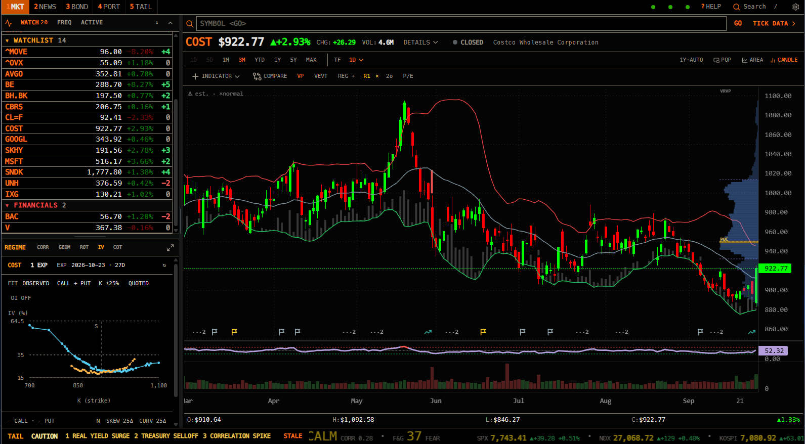

# Bloomberg Terminal

A personal Bloomberg-style financial terminal for local use: cross-asset market data, a
keyboard-driven chart workstation, bond/credit and tail-risk monitors, a portfolio book with
accounting checks, an investment-research workspace (theses, open questions, tracked numbers,
Zettelkasten) — and **ASK**, a chat panel on every view that answers from the terminal's own live
data. One dark UI backed by a Python data service.

> **Local by design.** There is no authentication layer. Writes to `/api/**` are accepted only from
> the app's own page, but anyone who can reach the frontend port can read and write everything.
> Do not expose it to the internet; on a network that is not yours start it with `--local-only`.



---

## Views

| Key | View | What it shows |
|-----|------|---------------|
| `1` | **MKT** | Watchlist (WATCH / FREQ / ACTIVE feeds), main chart with indicators, STRUCTURE panel (DEPTH · CORR · GEOM · ROT · IV), TICK DATA board (indices, US/JP rates, volatility, FX) |
| `2` | **NEWS** | Per-ticker news from 7 sources grouped by sector, topic feed, social, indicator DATA board, Polymarket column; ASK as a column of the view |
| `3` / `b` | **BOND** | MARKET: 10Y yield decomposition, Treasury and credit legs, corporate issuance (SEC 424B filings) with an event study, Treasury auctions, debt stock, CFTC Treasury-futures positioning · CONDITIONS: crisis level, financial-stress indices, breakevens, mortgage and delinquency data |
| `4` / `p` | **PORT** | PORTFOLIO (positions, options, trades, cash, entry) · ANALYTICS (P&L, TWR growth, XIRR) · RISK (VaR/CVaR, trade guard, what-if, margin) · TOOLS (THESES · QUESTIONS · TRACK · IMPORT · AUDIT) |
| `5` / `t` | **TAIL** | Named market events, 6 risk dimensions → composite, macro context (release calendar, Fed, curve, oil balance), sector rotation, CFTC positioning |
| `h` | **HMAP** | One equity market as a sector treemap sized by market cap (`heatmap(US)`, `heatmap(TH, 52w)` …) |
| `c` | **ASK** | Chat drawer over any view (see below) |

Any symbol opens the **stock view** from global search (`/` or `Ctrl+K`): financials, outlook
(SEC EDGAR), estimates, options, earnings quality, DCF, rate stress, per-symbol regime, and a COT
tab when the symbol maps to a CFTC contract. Views are real links (`?view=bonds`), so they open in
new tabs and survive Back/Forward, and shortcuts work on a Thai keyboard layout.

---

## ASK — chat with the terminal

The header icon or `c` opens ASK on any view (NEWS hosts it as a column). A question goes to a
model of your choice — DeepSeek by default; OpenAI, Anthropic, Gemini, OpenRouter, Groq or any
OpenAI-compatible server — which answers with **read-only tools**: quotes, history, the market
board, macro data and calendar, Polymarket, SEC filings, the text of the view you are looking at
and the data behind it, your theses / open questions / tracked numbers / research notes, news
search and page reading (web search with a Tavily or Brave key).

- Answers stream with their sources; pictures can be pasted, dropped or attached; formulas render with KaTeX.
- **HISTORY** keeps every conversation as a file outside the repository — in the Google Drive folder the
  portfolio syncs through, or the app-data folder of this machine (**STORAGE**). Conversations are grouped by
  day, can be filtered, pinned, deleted to a **TRASH** (restore, or erase for good) and continued later; a
  resumed conversation is told when each question was asked, so old figures are not repeated as today's.
  ASK can also search and read earlier conversations itself.
- Safety: ASK never writes. Once it has read private data, it opens only links a tool returned or you typed;
  tool results share a size budget per question.

Keys and the model are set from **MODEL ▸** in the panel (written to `backend/.env`, never shown again).

---

## Stack

| Layer | Tech |
|-------|------|
| Frontend | Next.js 16 (App Router), React 19, TypeScript |
| State | Jotai atoms + TanStack React Query |
| Charts | lightweight-charts (custom `chartkit/`) + Recharts |
| Styling | Tailwind CSS |
| Backend | Python FastAPI — 73 routers in `backend/routers/` |
| Database | SQLite (`backend/portfolio.db`); op-log sync between machines through a Google Drive folder |
| Market data | yfinance (through a provider registry and an app-wide Yahoo request gate), Yahoo pricing WebSocket for live quotes |
| Macro / rates | FRED, NY Fed ACM, Japan MOF, CBOE volatility CSVs, Treasury fiscaldata, EIA |
| Filings / positioning | SEC EDGAR (XBRL, 8-K, EFTS), CFTC Commitments of Traders |
| Other sources | Polymarket, Binance aggTrades, World Bank, BOT and SEC Thailand APIs, Fiscal.ai, Google Trends |
| AI | ASK (DeepSeek / OpenAI-compatible providers), Claude API (portfolio AI), MCP server for agents |

---

## Requirements

- Python 3.11+
- Node.js 20+
- A free [FRED API key](https://fred.stlouisfed.org/docs/api/api_key.html) — macro, rates, credit and TAIL need it
- For ASK: a key for one model provider (e.g. `DEEPSEEK_API_KEY`) — can be pasted in the panel
- Everything else is optional (see [Environment variables](#environment-variables))

---

## Setup

```bash
# backend
cd backend
pip install -r requirements.txt
cp .env.example .env          # add FRED_API_KEY at minimum

# frontend (repo root)
npm install
cp .env.local.example .env.local
```

## Run

| How | Command |
|-----|---------|
| Windows tray launcher | `BloombergTerminal.exe` in the repo root (build with `tools\launcher\build.bat`; `start.bat` builds it on first run) |
| Everything, one command | `npm run dev:all` (backend + frontend + Ollama) or `npm run dev:no-ollama` |
| Two terminals (Windows) | `cd backend && python dev_server.py --port 9317` and `npm run dev` |
| Two terminals (macOS/Linux) | `cd backend && python -m uvicorn main:app --port 9317 --reload --timeout-graceful-shutdown 3` and `npm run dev` |

The UI opens at **http://bloomberg.localhost:9318** (or `localhost:9318`). The backend listens on
**9317**. The launcher starts both servers hidden, writes `logs\backend.log` / `logs\frontend.log`,
restarts a crashed server and auto-reloads the backend through `backend/dev_server.py` (a saved
`.py` file is live in ~6 s; `--no-reload` to opt out). `--local-only` (or `npm run dev:local`) binds
the frontend to this machine — by default the LAN can open it, which is how a phone does. To start
it at log-on use `scripts\win\install-startup-task.ps1`.

In `next dev` a strip at the top of the page says **RUNNING OLD CODE** (with a RESTART button) or
**BACKEND DOWN** when the Python server is not the code on disk — check it before debugging a
"missing" route. `GET /api/dev/status` gives the same answer.

**Pulled and nothing changed?** `.env.local` and `backend/.env` are gitignored and an env var always
beats the default in code, so a port or key migration can silently not apply on another machine.
`npm run doctor` reports the drift (it also runs before `dev` and after a pull or branch switch);
`npm run doctor:fix` applies what it can.

---

## Environment variables

`backend/.env` (copy from `backend/.env.example`, which documents every key):

| Variable | Needed for |
|----------|-----------|
| `FRED_API_KEY` | **Required.** Macro, US rates, credit, TAIL, BOND |
| `DEEPSEEK_API_KEY` (or `OPENAI_API_KEY`, `GEMINI_API_KEY`, `OPENROUTER_API_KEY`, `GROQ_API_KEY`, `NEWS_AI_CUSTOM_URL`) | ASK; `NEWS_AI_PROVIDER` / `NEWS_AI_MODEL` pick the default |
| `TAVILY_API_KEY`, `BRAVE_API_KEY` | ASK general web search (optional, free tiers) |
| `ASK_SESSIONS_STORE`, `ASK_SESSIONS_DIR` | Where this machine keeps ASK conversations (`auto` · `drive` · `local` · `off`, or a folder outside the repo) |
| `ANTHROPIC_API_KEY` | Portfolio AI (`CLAUDE_MODEL`, `CLAUDE_MAX_TOKENS` optional); also an ASK provider |
| `ALPHA_VANTAGE_API_KEY` | Macro fallback when FRED is unreachable |
| `EIA_API_KEY` | TAIL oil balance (unset = public demo key, 10 calls/h) |
| `FISCAL_AI_API_KEY` | Fiscal.ai fundamentals and transcripts (MCP) |
| `BINANCE_API_KEY` | Crypto order-footprint indicator (read-only key) |
| `THESES_DIR`, `SOURCES_DIR`, `OBSIDIAN_WIKI_DIR`, `GRAPHS_DIR` | Thesis import/export, Zettelkasten export, analysis pages |
| `RSSHUB_URL`, `FACEBOOK_ACCESS_TOKEN` | Social feed |
| `BOT_API_TOKEN`, `BOT_IR_TOKEN`, `BOT_FX_TOKEN`, `BOT_STATS_TOKEN` | Bank of Thailand API |
| `SEC2_API_KEY` | SEC Thailand open data (Fund v2, Bond v2, One Report) |
| `SYNC_DIR`, `OPLOG_ENABLED`, `OPLOG_DEVICE_ID` … | Sync between machines (op-log through the cloud folder) |
| `YAHOO_MAX_CONCURRENT` | App-wide cap on in-flight Yahoo requests (default 6) |
| `IV_SNAPSHOT_INTERVAL`, `IV_SNAPSHOT_SYMBOLS` | Background ATM-IV recorder |
| `PORTFOLIO_DB` | Database file (default `portfolio.db`) |

`.env.local`: `PYTHON_API_URL=http://localhost:9317` (every Next.js proxy imports it from
`lib/constants.ts`); `DEV_ORIGINS` = extra host names the terminal is opened by (tunnel, VPN).

---

## Project structure

```
bloomberg-terminal/
├── app/api/                  Next.js proxy routes → Python backend (never call Yahoo from here)
├── proxy.ts                  Next 16 middleware: refuses cross-site writes to /api/**
├── components/bloomberg/
│   ├── ask/                  ASK — the only chat code (drawer, column, history, model panel)
│   ├── atoms/                Jotai state
│   ├── chart/ · chartkit/    chart engine, indicators, event rail, floating chart windows
│   ├── core/                 global search, shortcuts, backend status banner, shared UI
│   ├── hooks/ · lib/         data hooks, pure helpers (market session, number format …)
│   ├── layout/               terminal shell, header, view navigation
│   ├── terminal/             command registry (heatmap(US), ALERT …)
│   └── views/                market · news/ · bonds/ · heatmap · portfolio/ · tail/ · stock/
├── backend/
│   ├── main.py               app init + router mounting
│   ├── dev_server.py         auto-reload runner (uvicorn's reloader without the Windows stall)
│   ├── routers/              73 routers (market, stock, bonds, cot, portfolio_v2, news_ai, tail_risk …)
│   ├── ask_*.py · web_reader.py   ASK: page data, research reads, saved conversations, page reading
│   ├── analytics/            quantitative models (regime, market state, DCF, SVI, payoff …)
│   ├── sources/ · sync/      quote provider registry · op-log sync
│   ├── scripts/              maintenance: backfills, reconciliation, upstream report …
│   ├── tests/                pytest suite
│   └── mcp_server.py         MCP server for agents (docs/mcp-server.md)
├── tools/launcher/           Windows tray launcher (C)
├── scripts/                  env-doctor, icons, install/start scripts
├── docs/                     MCP, regime detection, terminal commands
└── memory/                   project knowledge base for agents (start at memory/INDEX.md)
```

---

## Portfolio book

- **Multi-account, multi-currency** (THB and USD), average-cost (AVCO) lots, options with Greeks,
  dividends, cash ledger with deposits/withdrawals/transfers and reasoned cash corrections.
- **Returns**: time-weighted NAV index (flows removed; capital that arrives on a non-trading day
  counts from the next open), XIRR from trades and from capital, period returns.
- **Portfolio takeover**: lots received in kind are carried at fair value on the transfer date
  (fund practice), with the previous owner's cost kept as a memo.
- **Risk**: VaR/CVaR with an out-of-sample backtest, TRADE GUARD (auto stops, sizing, alerts),
  what-if simulation, Reg T margin per account.
- **Accounting checks** (`GET /api/v2/portfolio/ledger/check`): reconstructed stock cards, cash
  identity, broker statement and execution evidence, audit log of every money edit.

## Research workspace

PORT → TOOLS: **THESES** (thesis text, notes, Zettelkasten, research pages), **QUESTIONS** (what a
thesis does not know yet; an answer needs evidence) and **TRACK** (the numbers a thesis stands or
falls on: forecast vs reading, kill lines). Agents work on the same data through the MCP server;
ASK reads it.

---

## Data health

Every outbound call is observed by `backend/upstream_health.py` and written to
`logs/upstream.jsonl`. When data is missing, stale or slow, read that log first:

```bash
python backend/scripts/upstream_report.py            # last 6h: failures, top targets, stale data
curl -s http://localhost:9317/api/health/upstream     # live state
```

---

## Agent access (MCP)

`backend/mcp_server.py` lets Claude Code / Claude Desktop read and edit investment theses, open
questions, tracked numbers and the Zettelkasten, and pull the terminal's own portfolio, price,
news and filing data over stdio. It talks to the running backend, so the event log and sync stay
identical to the UI. Setup: [docs/mcp-server.md](docs/mcp-server.md).

---

## Keyboard

| Key | Action |
|-----|--------|
| `1` `2` `3` `4` `5` | MKT · NEWS · BOND · PORT · TAIL |
| `b` `p` `t` `h` | BOND · PORT · TAIL · HMAP |
| `c` | ASK |
| `/`, `Ctrl+K` | Global symbol search |
| `i` | Focus the MKT symbol search |
| `y` | %Chg YTD ↔ daily (THB ↔ USD inside PORT) |
| `Alt+1…9` | Tab within the current view |
| `Esc` | Back / close overlay (closes ASK first) |
| `?` | All shortcuts |

---

## Tests

```bash
cd backend && python -m pytest -q    # ~1,660 tests (tests/ + slip_ocr/tests/)
npm run typecheck                     # tsc --noEmit
npm run test:chart                    # chart engine, event rail, regression
npm run test:session                  # market sessions, pure helpers
npm run test:views                    # market state, portfolio helpers
npm run test:alerts                   # alert rule engine
npm run test:watchlist                # market-data client/proxy
npm run test:ask                      # ASK history, sessions, math, proxy rules
npm run lint                          # biome
```

A pre-commit hook runs Biome and the type check on staged TypeScript (and re-adds the whole file,
so partial staging of a TS file does not survive it). CI runs the backend suite and the type
check on every pull request.

---

## Troubleshooting

- **Empty data / search returns nothing** — the backend must be running; check the status strip,
  then `logs/upstream.jsonl`. A mobile hotspot can block or rate-limit Yahoo.
- **ASK box disabled** — no model key: open **MODEL ▸** in the panel, or set one in `backend/.env`.
- **Volume Profile greyed out** — calculated indices, yields and FX report zero volume on Yahoo;
  chart a tradeable proxy (`VIXY`, `TLT`, `FXE`).
- **`npm ci` peer-dependency error** — keep `.npmrc` (`legacy-peer-deps=true`).
- **First run shows no symbols** — `symbol_lists` is seeded from `config.py` on backend start;
  check `logs/backend.log`.
- **Sync shows conflicts** — the header chip → REVIEW; `GET /api/sync/conflicts` lists them.

---

## Security notes

- No authentication. `proxy.ts` refuses writes to `/api/**` from any other site, but the frontend
  listens on the LAN by default — use `--local-only` on networks you do not control.
- `backend/.env`, `.env.local`, `backend/portfolio.db`, `backend/backups/` and `backend/cache/` are
  gitignored; ASK conversations are kept outside the repository (a folder inside it is refused).
- The upstream log never contains URLs with keys; analysis pages render under a strict CSP.

---

## License

MIT — personal/educational use. Not financial advice.
